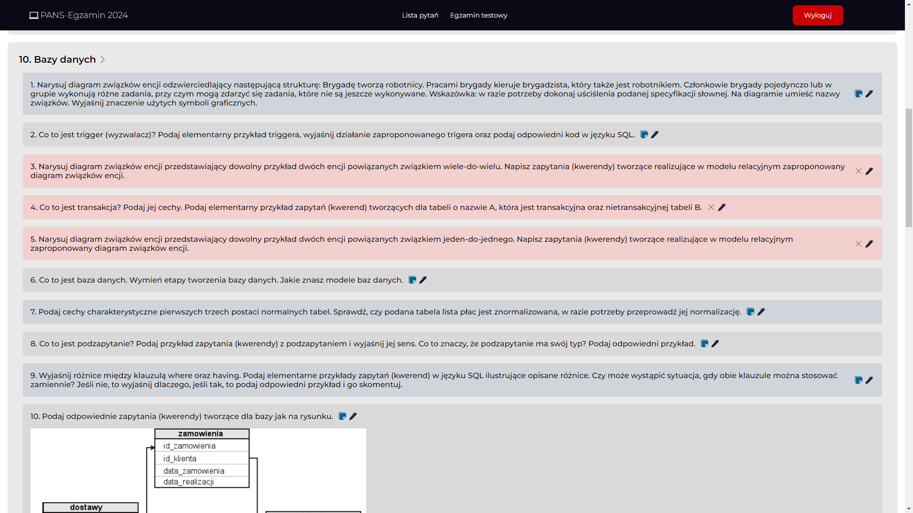
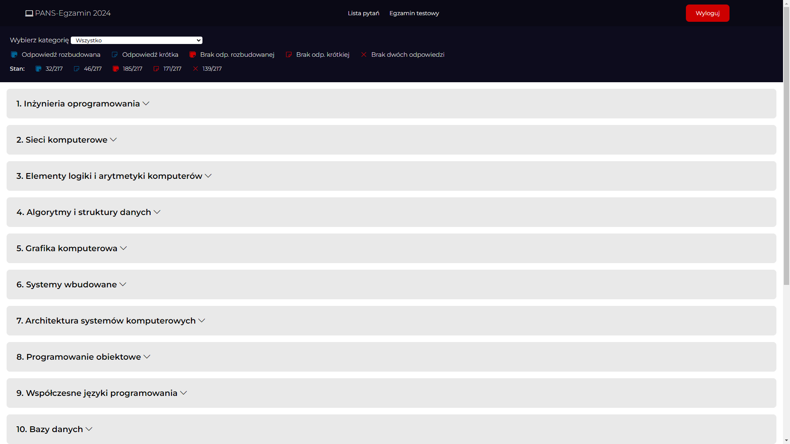
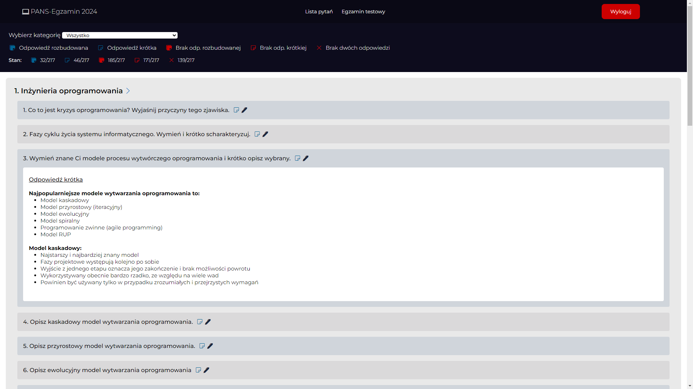
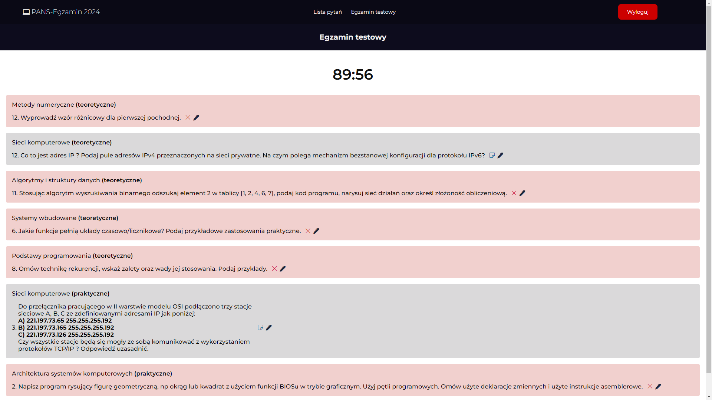
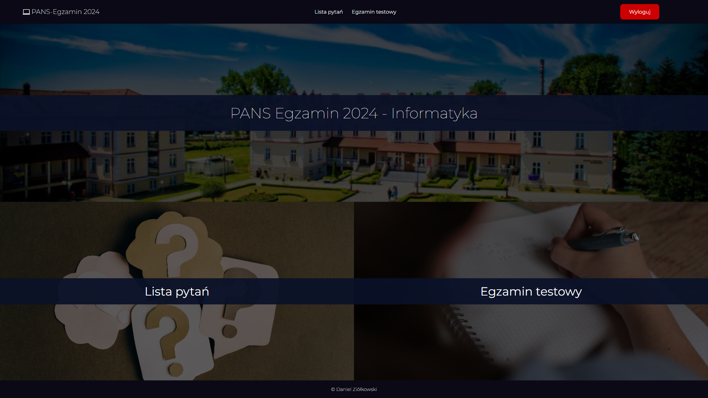
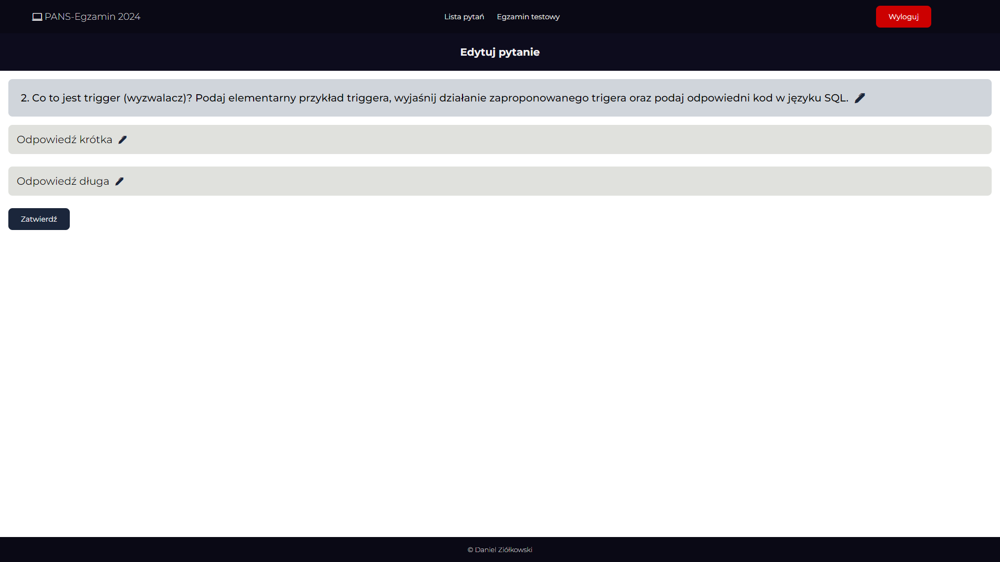
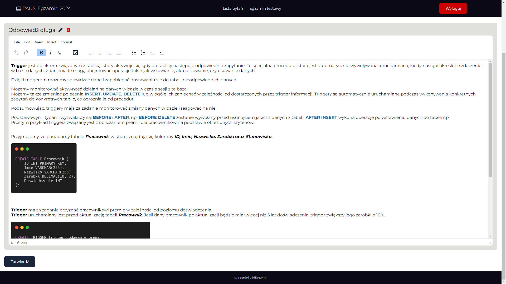

    
  <h3 align="center">PANS Exam App</h3>
  
   

## URL 
[pans-exam.pl](https://pans-exam.pl)   

## O Projekcie
Aplikacja dla studentów informatyki (PANS) stworzona na potrzeby egzaminu końcowego. 

### Funkcjonalności
* Pełna responsywność strony
* Logowanie 
* Autoryzacja (*Administrator*)
* Dodawanie, usuwanie, modyfikowanie pytań i odpowiedzi
* Pokazywanie i ukrywanie odpowiedzi
* Filtrowanie kategorii
* Losowanie pytań egzaminacyjnych
* Statystyki odpowiedzi
* Edytor WYSIWG z opcją dodawania zdjęć (TinyMCE)

### Stworzone za pomocą
* ![Laravel][Laravel.com]
* ![HTML][HTML5]
* ![CSS][CSS3]
* ![JS][JavaScript]

## Screeny

[Laravel.com]: https://img.shields.io/badge/Laravel-FF2D20?style=for-the-badge&logo=laravel&logoColor=white
[HTML5]: https://img.shields.io/badge/HTML5-E34F26?style=for-the-badge&logo=html5&logoColor=white
[CSS3]: https://img.shields.io/badge/CSS3-1572B6?style=for-the-badge&logo=css3&logoColor=white
[JavaScript]: https://img.shields.io/badge/JavaScript-323330?style=for-the-badge&logo=javascript&logoColor=F7DF1E

